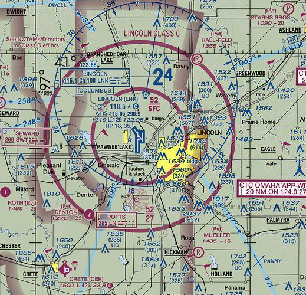
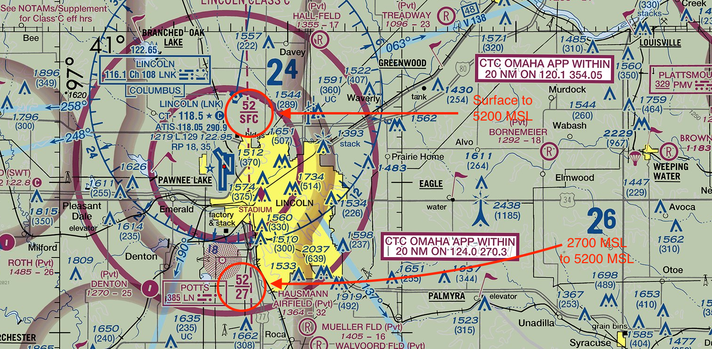
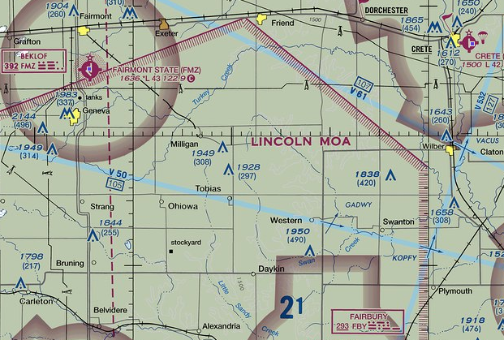

# Airspace

> Read Chapter 15 in the Pilot's Handbook of Aeronautical Knowledge

The National Airspace System is divided into slices that are described as an upside-down birthday cake. In each place, the rules are different. You must know how to identify what airspace you are flying in prior to going to the site to determine what is required of you.

**Notes**

1. There are two kinds of altitude: AGL and MSL -- Above Ground Level and Mean Sea Level. In aviation, both are used. You need to know when.

2. On a sectional chart, MSL is used. For drone operations, AGL is used. To translate MSL to AGL, you need to know the elevation you are at. Most of the time, the nearest airport will suffice. The airport elevation is in the Airport Facilities Directory, which we will discuss soon. So, for example, Class C airspace in Lincoln is controlled from the surface to 5,200 MSL. The Lincoln airport elevation is 1,200 feet above sea level. So Class C airspace extends from the surface to 4,000 feet AGL, or 3,600 feet higher than you can fly legally.

3. **Class A** airspace starts at 18,000 MSL. You do not need to know about Class A airspace, other than to know it exists and you can not fly in it.

4. **Class B** airspace surrounds the busiest airports in the country. Think Atlanta, Chicago, New York, Washington DC, Dallas, LA, San Francisco. If you change planes at that airport, it's likely a Class B airport. For drone operators, the Class B airspace that governs operators extends 5 miles from the Class B designated airport. For aircraft pilots, the Class B designation extends 30 nautical miles from the airport above 10,000 feet, and requires special training to enter and permission from Air Traffic Control (ATC) to enter.

5. **Class C** airspace surrounds the next level of airport. Think of places like Omaha and Des Moines -- places with commercial jet traffic but not busy hubs. The surface control zone that includes drone operators extends 5 miles from the airport in all directions. Outside of 5 miles, the Class C control zone extends to 10 miles from the airport above 1500 feet AGL, which is more than 1000 feet higher than an operator is allowed to fly legally.

6. **Class D** airspace generally extends less than 5 miles from the airport up to 2,500 feet AGL, and is reserved for airports with a partially operating control tower or no operating control tower.

7. **Class E** airspace is airspace that is either overlying Class G (or uncontrolled) airspace above 700 AGL or 1200 AGL, or airspace above an airport that has no tower but does have an instrument approach procedure for manned aircraft.

8. **Class G** airspace is the airspace we will most often work in. In areas near airports but not in surface control zones, Class G airspace extends to 700 feet AGL, which encompasses all of the 400 feet AGL drone operators can fly in. If the airspace is outside of 5 miles from an airport, and it is not designated with a restriction for some other reason, it is Class G airspace in the places where drone operators can fly.

## Reading a sectional chart

Each sectional chart has a chart legend, which is useful.

And the most important is the airspace markers on the sectional. 

* Class B = solid blue
* Class C = solid purple
* Class D = dotted blue
* Class E (surface) = dotted purple
* Class G = fuzzy purple

**Note**:

Class B and Class C airspaces have multiple segments. Only the innermost shapes go to the ground. For example, the Class C airspace around Lincoln is broken up into two segments - 5 miles from the tower (inner ring) and 10 miles from the tower (outer ring).

Only the inner circle goes to the surface. How do you know? The fractions. Each class B and C airspace will have markers that look like fraction that tell you what the floor (the denominator) is as well as the ceiling (the numerator).

**Other airspaces**:

* Prohibited areas. No flights are allowed, generally for national security reasons.
* Restricted areas. Flight is not prohibited, but requires additional levels of permissions to fly there. Generally they are areas where the military conducts exercises hazardous to aircraft.
* Military operations areas. MOAs are designated on the sectional chart with purple hashing, and again on the back of the sectional. MOAs are only active during certain times, and those times are designated on the sectional. Also included is the controlling agency in which to ask for permission.

* Alert areas. Must be vigilant.
* Military Training Routes. Denoted on a sectional chart as IRXXXX and VRXXXX. They are routes where the military conducts training flights at lower altitudes and at high speeds. If the route is all below 1500 feet AGL, the route will have a four-digit number, ex. VR1205. If one or more of the segments are above 1500 feet AGL, it will have three digits, ex. VR207. What do they mean? They mean extra vigilance. You can fly there, but you have to be extra cautious.

**Things you will be tested on**:

1. If I want to fly in X place, what airspace am I in?
2. What restrictions do I have?
3. What are the restrictions or responsibilities if I am near a symbol on the map?

## The AFD

The FAA publishes a book of information about each and every airport in the United States. It's called the AFD -- the Airport Facilities Directory. [The digital version is here](https://www.faa.gov/air_traffic/flight_info/aeronav/digital_products/dafd/search/). Airports are found through their formal airport code designation, and most will begin with the letter K. Lincoln, for example, is KLNK. Omaha is KOMA.

## Airspace Operational Requirements

**Basic weather minimums**

Each airspace classification has a set of weather minimums that manned pilots must comply with. UAS pilots, under Part 107, have a much more simplified weather minimums:

* 3 statute miles or greater visibility
* Minimum cloud distances: 500 feet below, 2,000 feet laterally.

In certain airspaces, manned aircraft can fly with lower visibility levels. You can not. These are the only weather minimums listed in Part 107. Practically speaking, wind, temperature and precipitation will have a significant impact on your operations. You should refer to your manufacturer's manual or the Drone Journalism Lab Operations Manual for more information.

## ATC clearances

To fly in controlled airspace, you need to get permission from ATC. How this is done isn't set in Part 107. How it currently works is a system called LAANC -- Low Altitude Authorization and Notification Capability. Most access is granted through smartphone apps -- the FAA has one, and it's terrible. You apply to fly in a location, specifying altitude and duration. You provide a name and a phone number and the FAA text you if you have permission. It takes seconds and is free.

### Maximum altitude limit

Under Part 107, all UAS flights must stay at or below 400 feet AGL unless they are close to a tall structure. Then they can go to 400 feet above the structure. Under certain circumstances, ATC may require a lower ceiling to ensure safety. For example: 400 feet above the Nebraska Capitol is 800 AGL and can be in a busy airway for manned aircraft on certain days. You may not get ATC permission for that altitude, even though it is Part 107 compliant. 

### Operations near airports

Part 107 is clear that you may not interfere with airport operations. In AC 107, the FAA elaborates:

  In order to avoid interfering with operations in a traffic pattern, remote PICs should avoid operating in the traffic pattern or published approach corridors used by manned aircraft. When operational necessity requires the remote PIC to operate at an airport in uncontrolled airspace, the remote PIC should operate the small UA in such a way that the manned aircraft pilot does not need to alter his or her flightpath in the traffic pattern or on a published instrument approach in order to avoid a potential collision. Because remote PICs have an obligation to yield right-of-way to all other aircraft and avoid interfering in traffic pattern operations, the FAA expects that most remote PICs will avoid operating in the vicinity of airports because their aircraft generally do not require airport infrastructure, and the concentration of other aircraft increases in the vicinity of airports.

## Common aircraft accident causal factors

> These come from chapter 7 of the [Aeronautical Information Manual](https://www.faa.gov/air_traffic/publications/atpubs/aim_html/)

These are the top 10 causes of accidents in manned flight. Most of them will be applicable to unmanned aircraft.

* Inadequate preflight preparation and/or planning
* Failure to obtain and/or maintain flying speed
* Failure to maintain direction control
* Improper level off
* Failure to see and avoid objects or obstructions
* Mismanagement of fuel
* Improper in-flight decisions or planning
* Misjudgment of distance and speed
* Selection of unsuitable terrain
* Improper operation of of flight controls.

### Laser operations and reporting illuminating aircraft

The FAA, for years, has received reports of people aiming lasers at aircraft. In the AIM, it says these lasers can temporarily blind manned aircraft pilots, creating a major hazard to flight, which is not allowed. All pilots, UAS or otherwise, are asked to report any laser illumination of aircraft to the nearest ATC facility.

### Miscellaneous hazards

* Avoid flight beneath unmanned balloons. They often have tethers or hard-to-see wiring beneath them.
* Avoid flying near thermal plumes such as smoke stacks and cooling towers. The unstable and rapidly rising air will make control difficult and greatly increase the risk of a crash.
* Flying near wires requires a substantial degree of caution and risk awareness. Wires can be difficult to impossible to see, so great care must be taken when flying near radio towers or high capacity electrical lines.
* Precipitation static can occur when aircraft come in contact with precipitation that is uncharged. The result is a significant negative charge can build up, which will discharge into something called a "cornona." The coronoa will discharge the energy out of the aircraft's extremities, and will cause massive disruption to the aircraft's electrical systems. This is highly unlikely to occur on small UAS, especially those with plastic shells, and especially those that are not weatherized.

## NOTAMS

A NOTAM is a Notice To Airmen that alerts a pilot to something that could affect flight. Most often, they are issues with airport equipment, which will not affect you. But you need to check them to make sure it is safe to fly.

[NOTAMs can be found through a web interface](https://notams.aim.faa.gov/notamSearch/nsapp.html), through various commercial apps and through a Flight Services briefing, either by phone or online.
