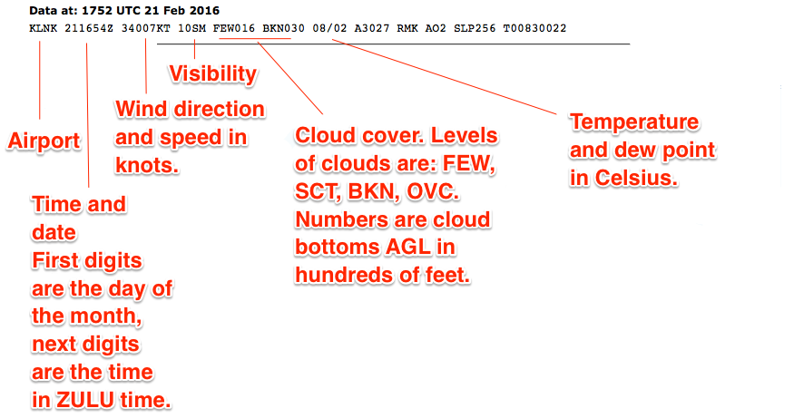

# Weather

> Read Chapter 12 in the Pilot's Handbook of Aeronautical Knowledge. It's good, and it will be one of the largest areas tested.

Weather for drones is pretty simple:

**Precipitation**: If it's wet out, you don't fly. Period. These devices aren't waterproof and water will kill them. Snow, rain, sleet, etc. is a no go.

**Temperature**: If it's bitter cold out, you will ruin your batteries. You might still fly if it's worth torching $75-$150 batteries, but understand anything below 50 degrees will degrade battery performance and flight time.

**Visibility**: Part 107, you are limited to flights in VFR conditions: 3 miles of visibility, 500 feet below and 2,000 feet laterally from clouds. So how do you determine if there is 3 miles of visibility?

1. Be smart. If you look outside and it's foggy, you do not have 3 miles of visibility.
2. Check visibility at the nearest airport at [aviationweather.gov](http://aviationweather.gov/). Click METAR and search for the airport code of the nearest airport.
3. Look for a prominent landmark near you that you can either map or estimate the distance to it.

## Weather theory

Weather is the result of the uneven heating of the planet, which creates air of different temperatures and air pressures. The interaction of these things is what makes weather.

**Chapter 12 of the Pilot's Handbook of Aeronautical Knowledge covers this in-depth and it's very much worth reading.**

We will cover the parts of weather specifically mentioned by the airman certification standards.

### Density altitude

There are multiple concepts to understand here:

* Atmospheric pressure: The force the air exerts. As altitude increases, air pressure decreases. Standard pressure, at sea level is 29.92 millibars of mercury. Pressure at altitude is adjusted to be on the same scale as sea level pressure for altimeters. For drones, this isn't an issue.

* Density altitude: The altitude of your aircraft adjusted for non-standard temperature and pressure. As you go up, the air gets thinner. With less air to work with, aircraft performance is affected. Airplanes need longer distances to take off. Propellers become less effective. As pressure decreases, there is a pronounced effect on performance.

### Wind and currents, air masses and fronts

**General information**: Air flows from high pressure to low. High pressure systems are usually dry, stable descending air masses. Low pressure systems tend to be unstable and brings clouds and precipitation.

**Convective currents**: In warm weather, different surfaces radiate heat at different rates. This can cause air to rise at different rates, which creates updrafts. In warm weather at low altitudes, you can expect turbulence because of that rising air.

**Low-level wind shear**: Wind shear is a sudden, drastic change in wind speed or direction. Wind shear can subject aircraft to violent changes in altitude and attitude. Most often associated with passing frontal systems, thunderstorms and temperature inversions with strong upper level winds.

### Stability

Stability of the air depends on its ability to resist vertical motion. Rising air is unstable. Some impacts on stability:

**Inversion**: When air rises, it expands and cools. But sometimes, the temperature _rises_ with altitude. That's an inversion. It's usually a shallow layer of smooth stable air close to the ground. If the humidity of the air below the inversion layer is high, it could lead clouds, fog, haze or smoke diminishing visibility.

### Temperature and humidity

Temperature and humidity has an impact on aircraft performance. Warm humid air decreases aircraft performance -- water vapor is lighter than air, which makes it rise.

## Cloud ceilings and visibility

With clouds, there are various levels of intensity:

* CLR or clear = less than 1/8
* FEW or few 1/8 - 2/8
* SCT or scattered 3/8 - 4/8
* BKN or broken 5/8 - 7/8
* OVC or overcast 8/8.

A cloud ceiling is the lowest layer of clouds reported as broken or overcast. The cloud ceiling is reported in AGL. So a cloud ceiling report of BKN at 700 would be broken at 700 feet AGL. Since drones have to be 500 feet from clouds, that would limit your ceiling to 200 feet AGL.

Visibility is the greatest horizontal distance at which prominent objects can be seen with the naked eye. It is reported in statute miles.

## Aviation weather sources

Chapter 13 of the Pilot's Handbook of Aeronautical Knowledge goes into detail on all of the services available. You should especially study the differences between a standard briefing, an abbreviated briefing and an outlook briefing.

The most commonly used weather report is the METAR (Aviation Routine Weather Report) and the TAF (Terminal Area Forecast).

### Decoding METAR

This is a METAR report that you'll have to decode. 

KLNK 151754Z 23006KT 10SM CLR 06/01 A2983 RMK AO2 SLP109 I6000 T00560006 10056 21044 58015

**Decoding KLNK 151754Z**: This is raw METAR output for KLNK. It's for the 15th of the month, at 1745 ZULU time, which is six hours ahead of US Central Standard Time. It drops to five with Daylight Savings Time.

**Decoding 23006KT**: Winds are at 230 degrees at 6 knots. South is 180. North is 0. East is 090, west is 270. So the winds are out of the southwest at 6 knots.

**Decoding 10SM CLR**: This is the visibility. In this case, it's 10 Statute Miles Clear. If there are clouds, it will note it here. Instead of CLR, it'll give the cloud ceilings. In Omaha right now, the visibility report says 10SM FEW250 -- meaning there are a few clouds at 25,000 feet. If it said FEW008 it would mean there were clouds at 800 feet, and you'd have to fly no higher than 300 feet to maintain 500 feet of clearance from clouds.

**Decoding 06/01**: This is the temperature and dew point in Celsius. 6 degrees C with a dew point of 1 degree C. That's about 43 degrees F. To be totally safe with the batteries, the temperature should be 10 C, or 50 F.

**Wind**: The aircraft you are using are going to be between 3 and 6 pounds, which means winds will factor in greatly. The maximum winds these devices can be expected to even function in is 20 knots (about 25 miles per hour). The Drone Journalism Lab Safety Manual caps operations at 15. If the winds are in excess of 15 knots, control will be too unpredictable and minimum safety levels can't be guaranteed. If safety is ever questioned, we scrub the flight.

**NOTE**: If the visibility report includes SH (showers), TS (thunderstorms), FZ (freezing) or DZ (drizzle), RA (rain), SN (snow) or about anything else, it means there is weather at the airport and that pretty much scrubs the flight. Remember: Wet = Drone death.

### ASOS/AWOS

Stands for Automate Surface Observing System or Automated Weather Observing System. Very similar to a METAR. Is online at [https://www.faa.gov/air_traffic/weather/asos/](https://www.faa.gov/air_traffic/weather/asos/)

**NOTE**: Study the PHAK on Weather Charts as well.
