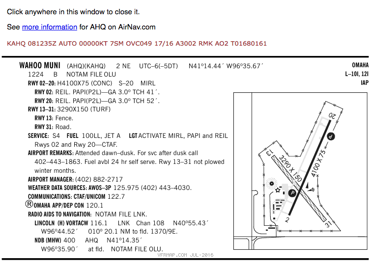

# Airport Operations and Radio Procedures

> Read Chapter 14 in the Pilot's Handbook of Aeronautical Knowledge

Under Part 107, you are not required to communicate with ATC directly like manned aircraft must, but if you are going to operate in controlled airspace or near an airport, you may be required by ATC to be able to monitor traffic frequencies for situational awareness.

There are two types of airports:

* Non-towered, which means there is no control tower. At non-towered airports, pilots are supposed to radio their positions over a Common Traffic Advisory Frequency (CTAF) to inform other pilots where they are, though not all do, and some forget a call or two.
* Towered airport, which means there is an ATC run tower at the airport and two-way communication is required with the tower to operate at the airport. Pilots will NOT call out their location in the traffic pattern at towered airports.

There are also heliports and seaplane bases throughout the country marked on Sectional Charts. They are far less common than other airports.

### Runway markings and signage

Since UAS are not allowed to interfere with airport operations, and flying close enough for you to read airport markings and signage from the ground would most certainly do that, I'm not sure why the FAA says this is important for you to know. The most critical runway marking for you to learn is the number at the end of the runway. That two-digit number represents the magnetic heading of the runway. Headings are rounded to the nearest 10 and the zero is dropped from the number. So a runway 350, 10 degrees west of due north, is designated runway 35. Both ends of the runway are designated, by their heading. The other end of runway 35 would be runway 17, 10 degrees east of due south.

Manned aircraft take off and land into the wind. If an airport has multiple runways, takeoff and landing will occur in the direction most favorable to headwinds. At towered airports, ATC will direct pilots to the operable runway, and the runway will be designated in ATIS broadcasts.

### Sources for airport data

Information about the airport and its traffic procedures can be found in the AFD, on Sectional Charts and through NOTAMs.

The most important things you are looking for as a UAS pilot:

* The CTAF/UNICOM or tower frequency for traffic awareness at a non-towered airport.
* The CT or Control Tower frequency at a towered airport.
* The ATIS or AWOS frequency for information about which runway is in use and other weather information.

### Traffic patterns

Each airport will have a standard traffic pattern for landing and departing aircraft. For drone pilots flying near airports, the key is to know where to expect aircraft flying in the traffic pattern. Pattern flight is considered a critical phase of manned flight, and the pilot is managing a lot of information and executing tasks for landing and takeoff. The reason the FAA wants you to know traffic patterns is so you can see and avoid particularly vulnerable aircraft and pilots focused elsewhere.

The standard traffic pattern around most airports is a rectangle of all left turns. For small manned aircraft (i.e. not jets or multi-engine aircraft), the pattern is usually contained within a mile of the airport, though ATC can and does extend different portions for traffic separation. Each leg of the rectangle is named:

* Departure, or upwind: The leg immediately after takeoff. The aircraft on an upwind leg will be climbing toward the traffic pattern altitude, which is normally 1,000 feet AGL. If the aircraft is going to remain in the traffic pattern, they will turn 90 degrees to the crosswind leg. If they intend to depart the pattern, they'll exit either straight on course out of the upwind leg, or turn 45 degrees left or right of the upwind leg and depart.
* Crosswind: The first turn after the upwind leg, turning perpendicular to the runway. The aircraft will still be climbing on this portion but should be close to traffic pattern altitude (TPA).
* Downwind: The aircraft is now parallel with the runway. The downwind leg is important for two reasons: First, abeam the end of the runway, the aircraft will begin to descend. Second, aircraft entering the pattern are instructed to enter the downwind leg at at 45 degree angle abeam the midpoint of the runway.\
* Base: The aircraft is descending perpendicular to the runway and slowing down.\
* Final: The landing leg of the pattern. The aircraft will be at its lowest and slowest on this leg, which gives the pilot little margin to avoid obstacles.

Not all airports can follow the left turn pattern. Some, with parallel runways, will orient the pattern away from the other runway -- one left, one right -- and include a No Transgression Zone between them that pilots cannot enter for collision avoidance. Some airports have obstacles or development on one side of the runway that prevent a safe traffic pattern over it. If the traffic pattern is non-standard, it will be noted in the AFD.
